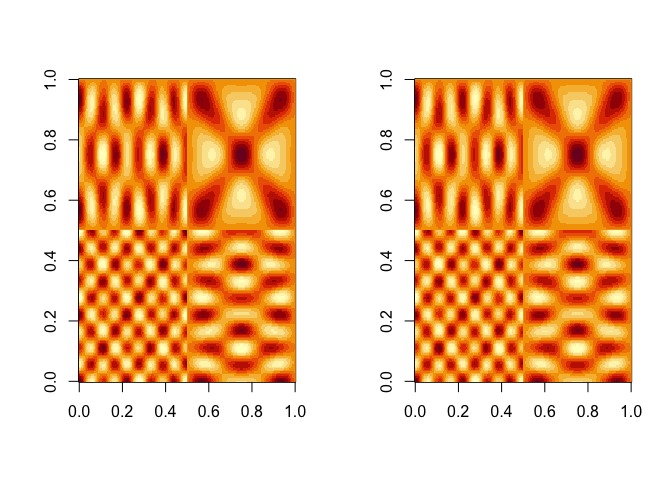
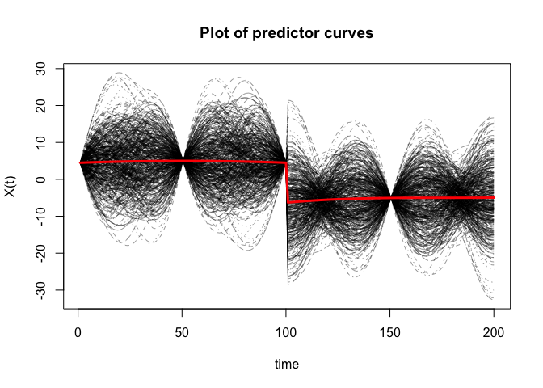
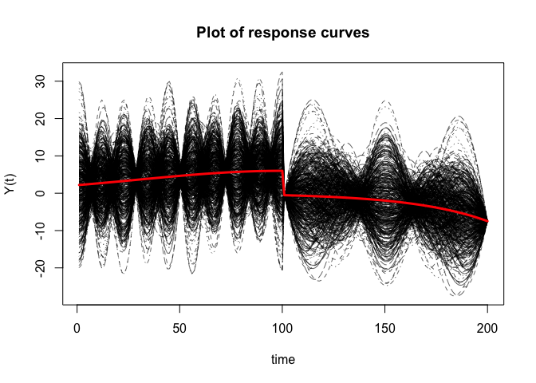
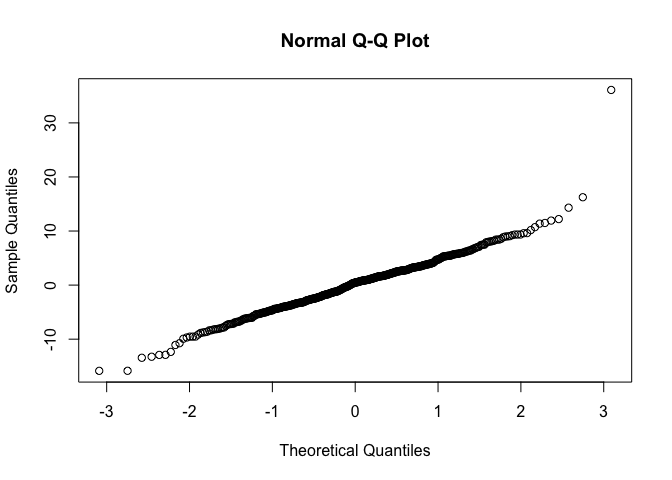
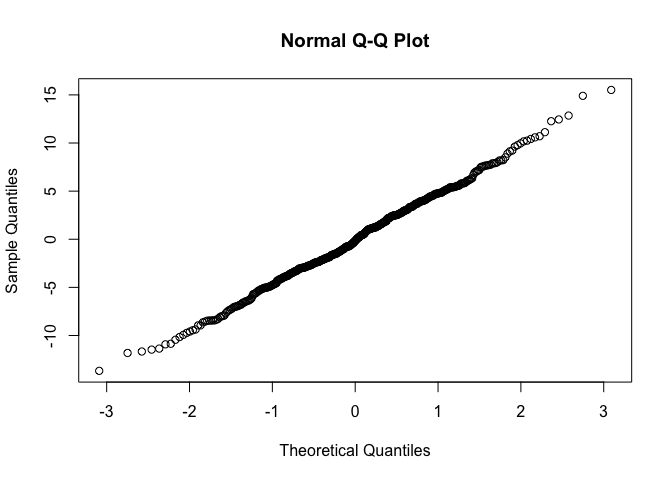
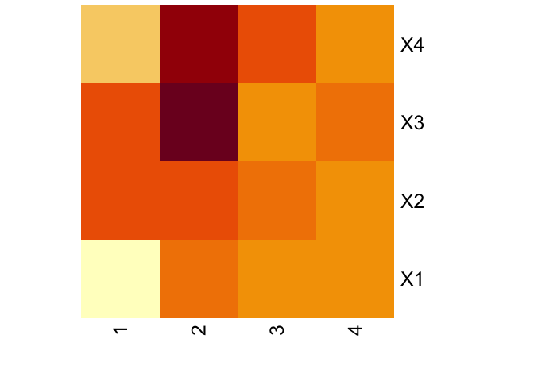
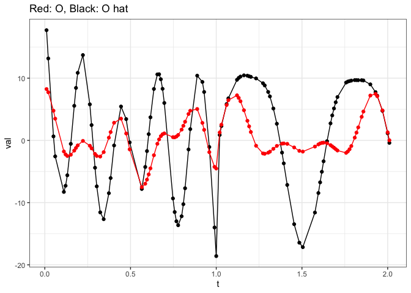
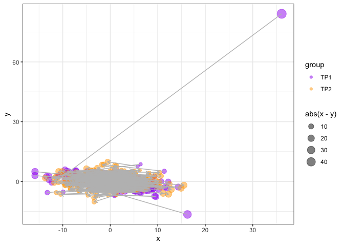

Noiseless-CV
================

``` r
library(FunOnFun)
library(fdapace)
library(tidyverse)
```

``` r
rm(list = ls())
```

``` r
.closest_t = function(actual_time, hat_time){
  closest = rep(NA, length(actual_time))
  for(i in 1:length(actual_time)){
    closest[i] = which.min(abs(actual_time[i] - hat_time))
  }

  return(closest)
}
```

# Generate Data

## Covariates

``` r
t = seq(0, 1, length.out = 100)

n = 500

components = 3

mean_funs = list(
  function(t) -2*(t-0.5)^2 + 5,
  function(t) 3*(t-0.75)^3 - 5
)

eigen_funs_list = list(
  list(
    function(t) sin(2*pi*t),
    function(t) sin(4*pi*t),
    function(t) sin(6*pi*t)
  ),
  list(
    function(t) cos(3*pi*t),
    function(t) cos(pi*t),
    function(t) cos(5*pi*t)
  )
)

lambdas = c(5, 3, 1)

X = FunOnFun::simMFPCA(16, t, n, 3, mean_funs, eigen_funs_list, lambdas, response = FALSE)
```

## Response

``` r
mean_funs = list(
  function(t) 6*exp(-(t-1)^2),
  function(t) -2*14^(t-0.5)
)

eigen_funs_list = list(
  list(
    function(t) cos(9*pi*t),
    function(t) cos(5*pi*t),
    function(t) cos(2*pi*t)
  ),
  list(
    function(t) sin(3*pi*t),
    function(t) sin(5*pi*t),
    function(t) sin(7*pi*t)
  )
)

# B = matrix(c(-1, 0.5, 0.1, -0.5, 1, 0.1, 0.5, 0.5, -0.05),
#            nrow = components,
#            ncol = components)

B = diag((rep(1, 3)))


Y = FunOnFun::simMFPCA(16, t, n, 3, mean_funs, eigen_funs_list, lambdas, response = TRUE, B = B)

set.seed(0)
sigma = 0.001
E = matrix(rnorm(2*length(t)*n, mean = 0, sd = sigma), n, 2*length(t))

Y$X = Y$X + E
```

## Orthogonalize Response

``` r
popEig = FunOnFun::populationEigen(Y, B, t, sigma)

par(mfrow=c(1, 2))
image(popEig$pop_covY)
image(cov(Y$X))
```

<!-- -->

## Plot Simulated Data

``` r
matplot(t(X$X), 
        type='l', 
        ylab='X(t)', 
        xlab='time', 
        main='Plot of predictor curves', 
        col=rgb(0,0,0,alpha=0.4))
matlines(apply(t(X$X), 1, mean),
         type='l',
         lwd=3,
         lty=1,
         col="red")
```

<!-- -->

``` r

matplot(t(Y$X), 
        type='l', 
        ylab='Y(t)', 
        xlab='time', 
        main='Plot of response curves', 
        col=rgb(0,0,0,alpha=0.6))
matlines(apply(t(Y$X), 1, mean),
         type='l',
         lwd=3,
         lty=1,
         col = "red")
```

<!-- -->

## Simulate Missingness

``` r
X_miss = FunOnFun::simMiss(50, X$X, t, seed = 51) # Missing rate 50%
Y_miss = FunOnFun::simMiss(50, Y$X, t, seed = 51)
```

## FPCA

``` r
df = X_miss %>% FunOnFun::tibbleFormat(t) %>% FunOnFun::fpcaFormat(id_col = "id")
df_Y = Y_miss %>% FunOnFun::tibbleFormat(t) %>% FunOnFun::fpcaFormat(id_col = "id")
```

``` r
res_X1 = fdapace::FPCA(df$Variable1,
                       df$Time,
                       list(dataType = "Sparse",
                            error = F,
                            kernel = "epan",
                            verbose = F,
                            nRegGrid = length(t)))

res_X2 = fdapace::FPCA(df$Variable2,
                       df$Time,
                       list(dataType = "Sparse",
                            error = F,
                            kernel = "epan",
                            verbose = F,
                            nRegGrid = length(t)))

res_Y1 = fdapace::FPCA(df_Y$Variable1,
                       df_Y$Time,
                       list(dataType = "Sparse",
                            error = T,
                            kernel = "epan",
                            verbose = F,
                            nRegGrid = length(t),
                            methodSelectK = 3))
res_Y2 = fdapace::FPCA(df_Y$Variable2,
                       df_Y$Time,
                       list(dataType = "Sparse",
                            error = T,
                            kernel = "epan",
                            verbose = F,
                            nRegGrid = length(t),
                            methodSelectK = 3))
```

## Irregular MFPCA

``` r
res = FunOnFun::irregMFPCA(components = 5,
                           split = T,
                           res_X1,
                           res_X2)

res_Y = FunOnFun::irregMFPCA(components = 5,
                             split = T,
                             res_Y1,
                             res_Y2)
```

# CV Debug

``` r
time_points_x = nrow(res$unstacked_phi) # 100
time_points_y = nrow(res_Y$unstacked_phi) # 100
nvars = nrow(res$stacked_phi) / time_points_x # 2

t1 = ncol(res$xi) # 5
t2 = ncol(res$xi) # 5

# Full Model
i = j = 4

# Scores
X = res$xi[, 1:i, drop = F]
Y = res_Y$xi[, 1:j, drop = F]

# ISSUE 1: Normality
qqnorm(X[,1])
```

<!-- -->

``` r
qqnorm(Y[,1])
```

<!-- -->

``` r


# Eigenvalues
eX = diag(res$Dhat)[1:i]
eY = diag(res_Y$Dhat)[1:j]

# (OPTIONAL) Reapply normalizing scale
# X = X %*% diag(eX)
# Y = Y %*% diag(eY)

# Eigenfunctions
PhiX = res$stacked_phi[, 1:i, drop = F]
PhiY = res_Y$stacked_phi[, 1:j, drop = F]

# Score by Score Regression
mod = lm(Y ~ -1+X)
B = mod$coefficients

# ISSUE 2: Regression fit
heatmap(B, Rowv = NA, Colv = NA, scale = "none")
```

<!-- -->

``` r

# In Bag Estimation
Yhat = X %*% B

# ISSUE 3: Poor fit in estimating scores
vis = data.frame(
  val = c(c(Y), c(Yhat)),
  type = c(rep("Actual", n*i), rep("Hat", n*i)),
  order = c(rep(1:i, each = n), rep(1:i, each = n)),
  index = rep(1:n, i)
)
vis %>%
  ggplot(aes(x = index, y = val, color = type))+
  geom_point()+
  geom_line()+
  facet_wrap(~order, scales = "free_y")+
  theme_bw()
```

<!-- -->

``` r

# Estimate original functional profile
orighat = PhiY %*% t(Yhat) %>% as.data.frame()

# Name for convenience
colnames(orighat) = as.character(1:n)

# Append Time column
# Add slight lag for visualization purpose
orighat$t = rep(seq(0, 1, length.out = time_points_y), nvars)
orighat$t[(time_points_x+1):(time_points_x+time_points_y)] = orighat$t[(time_points_x+1):(time_points_x+time_points_y)] + 1.01

# CHOOSE CASE HERE
# 246 is bad
case = 246

# Visualize
closest = .closest_t(df_Y$Time[[case]], seq(0, 1, length.out = time_points_y))
increment = rep(0:(nvars-1) * time_points_y, each = length(closest))
final = rep(closest, nvars) + increment

orighat_case = cbind(orighat[final, case], orighat[final, "t"]) %>%
  as.data.frame() %>%
  rename(val = V1, t = V2)

orig_case = data.frame(
  case = df_Y[case, 3:(3+nvars-1)] %>% unlist() %>% unname() - c(res_Y1$mu, res_Y2$mu)[final],
  t = orighat_case$t
)

orighat_case %>%
  ggplot() +
  geom_point(data = orighat_case, aes(x = t, y = val)) +
  geom_line(data = orighat_case, aes(x = t, y = val)) +
  geom_point(data = orig_case, aes(x = t, y = case), color = "red") +
  geom_line(data = orig_case, aes(x = t, y = case), color = "red") +
  theme_bw() +
  labs(title = "Red: O, Black: O hat")
```

<!-- -->

``` r

SST = sum(orig_case^2)
SSR = sum((orig_case-orighat_case)^2)
(R2 = 1-SSR/SST)
#> [1] -3.87006
```

## Check Average Across Cases

``` r
SSRs = rep(NA, n)
SSTs = rep(NA, n)
for(case in 1:n){
  closest = .closest_t(df_Y$Time[[case]], seq(0, 1, length.out = time_points_y))
  increment = rep(0:(nvars-1) * time_points_y, each = length(closest))
  final = rep(closest, nvars) + increment
  
  orighat_case = orighat[final, case]
  
  orig_case = data.frame(
    case = df_Y[case, 3:(3+nvars-1)] %>% unlist() %>% unname() - c(res_Y1$mu, res_Y2$mu)[final]
  )
  
  SSTs[case] = sum(orig_case^2)
  SSRs[case] = sum((orig_case-orighat_case)^2)
}

(meanR2 = 1 - mean(SSRs) / mean(SSTs))
#> [1] 0.9242515

summary(SSRs)
#>     Min.  1st Qu.   Median     Mean  3rd Qu.     Max. 
#>    3.216   66.506  141.417  264.836  290.854 6155.169
summary(SSTs)
#>     Min.  1st Qu.   Median     Mean  3rd Qu.     Max. 
#>    30.23   969.36  2221.18  3496.25  4673.03 27605.86

range((1-SSRs/SSTs))
#> [1] -4.4731010  0.9971425
```

## Check Scores

``` r
df1 = as.data.frame(X[,1:2])
df2 = as.data.frame(Y[,1:2])

df_combined = rbind(
  data.frame(id = row.names(df1), x = df1$V1, y = df1$V2, group = "TP1"),
  data.frame(id = row.names(df1), x = df2$V1, y = df2$V2, group = "TP2")
)
df_arrows = merge(df1, df2, by = "row.names", suffixes = c("_1", "_2"))

df_combined %>%
  ggplot()+
  geom_point(aes(x = x, y = y, color = group, size = abs(x-y)), alpha = 0.5) +
  scale_color_manual(values = c("purple", "orange")) +
  geom_segment(data = df_arrows, aes(x = V1_1, y = V2_1, xend = V1_2, yend = V2_2), 
               arrow = arrow(length = unit(0.2, "cm")), color = "gray") +
  theme_bw()
```

<!-- --> \#
Full CV

## Get Folds

``` r
# Folds
set.seed(16)
fld = caret::createFolds(1:nrow(res$xi), k = 10, list = F)
```

``` r
# Time Points and Predictors
fmatrix = matrix(nrow = 5, ncol = 5)
for(i in 1:5){
  for(j in 1:5){
    # Subset Data and EigenFunctions
    X = res$xi[, 1:i, drop = F]
    Y = res_Y$xi[, 1:j, drop = F]
    PhiX = res$stacked_phi[, 1:i, drop = F]
    PhiY = res_Y$stacked_phi[, 1:j, drop = F]
    kfoldR2s = rep(NA, 10)
    
    # Loop through all folds
    for(k in 1:10){
      fld_case = which(fld == k, fld)

      # Regression on remaining 9 folds
      mod = stats::lm(Y[fld != k, ] ~ -1 + X[fld != k, ])
      
      # Extract coefficients
      B = mod %>% stats::coef()
      
      # Get out of bag fitted values
      # One outlier in there
      Yhat = X[fld == k, , drop = F] %*% B
      
      # Estimate original profile
      orighat = PhiY %*% t(Yhat) %>% as.data.frame()
      
      # Step to name orighat
      nameCases = c(1:n)[(1:n %in% fld_case)]
      colnames(orighat) = nameCases
      
      # Append Time column
      orighat$t = rep(seq(0, 1, length.out = time_points_y), nvars)
      
      # Now for each case in the bag, we must match each function value to its closest estimate
      # For all cases in the fold, we are taking the average of SSTs and SSRs
      SSTs = rep(NA, sum(fld == k))
      SSRs = rep(NA, sum(fld == k))
      for (case in nameCases){
            # Find closest function values from our estimated functions
            closest = .closest_t(df_Y$Time[[case]], seq(0, 1, length.out = time_points_y))
            increment = rep(0:(nvars-1) * time_points_y, each = length(closest))

            final = rep(closest, nvars) + increment

            orighat_case = orighat[final, which(case == nameCases)]
            orig_case = df_Y[case, 3:(3+nvars-1)] %>% unlist() %>% unname() - c(res_Y1$mu, res_Y2$mu)[final]

            # The mean function is a 0 function.
            SSTs[which(case == nameCases)] = sum(orig_case^2)
            SSRs[which(case == nameCases)] = sum((orig_case-orighat_case)^2)

      }
      kfoldR2s[k] = 1 - mean(SSRs)/mean(SSTs)
    }
    fmatrix[i, j] = mean(kfoldR2s)
  }
}

which(fmatrix == max(fmatrix), arr.ind = T)
#>      row col
#> [1,]   5   3
```
