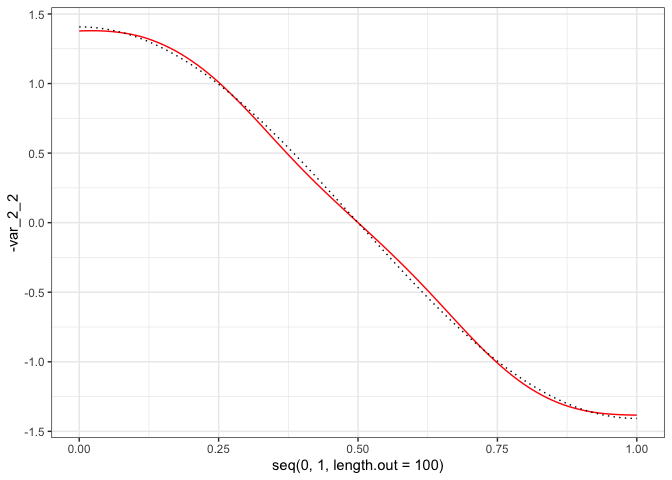
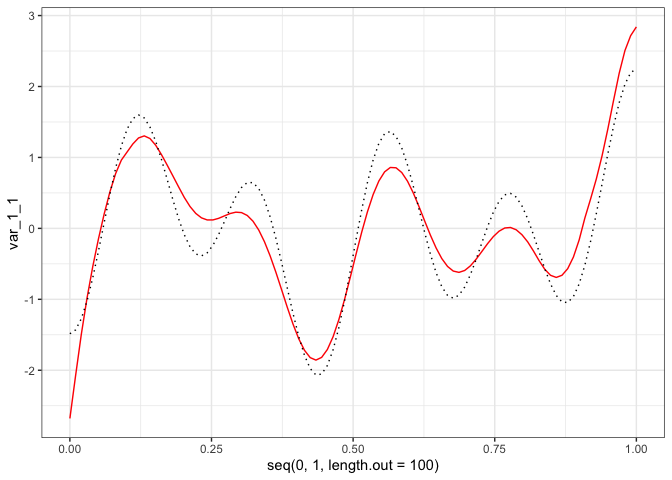
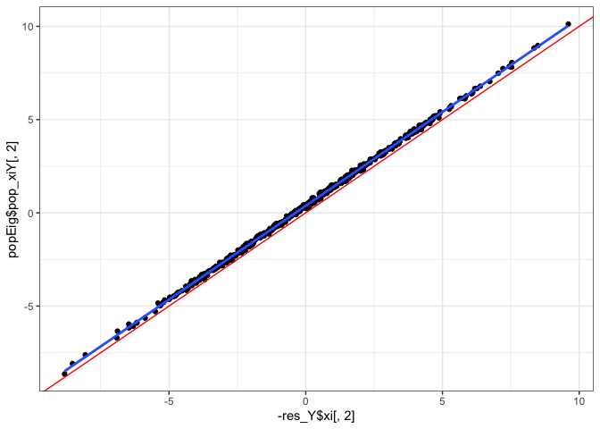
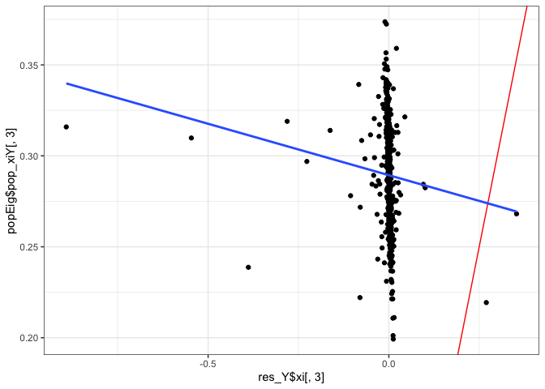
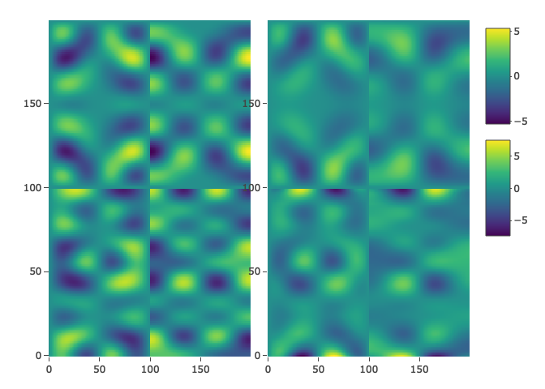

Simulated_Data_Analysis
================

``` r
library(FunOnFun)
library(fdapace)
library(ggplot2)
```

## Simulate Data

### Covariates

``` r
t = seq(0, 1, length.out = 100)

n = 500

components = 3

mean_funs = list(
  function(t) -2*(t-0.5)^2 + 5,
  function(t) 3*(t-0.75)^3 - 5
  )

eigen_funs_list = list(
  list(
    function(t) sin(2*pi*t),
    function(t) sin(4*pi*t),
    function(t) sin(6*pi*t)
  ),
  list(
    function(t) cos(3*pi*t),
    function(t) cos(pi*t),
    function(t) cos(5*pi*t)
  )
)

lambdas = c(5, 3, 1)

X = FunOnFun::simMFPCA(16, t, n, 3, mean_funs, eigen_funs_list, lambdas, response = FALSE)
```

### Response

``` r
mean_funs = list(
  function(t) 6*exp(-(t-1)^2),
  function(t) -2*14^(t-0.5)
)

eigen_funs_list = list(
  list(
    function(t) cos(9*pi*t),
    function(t) cos(5*pi*t),
    function(t) cos(2*pi*t)
  ),
  list(
    function(t) sin(3*pi*t),
    function(t) sin(5*pi*t),
    function(t) sin(7*pi*t)
  )
)

B = matrix(c(-1, 0.5, 0.1, -0.5, 1, 0.1, 0.5, 0.5, -0.05),
           nrow = components,
           ncol = components)

# B = matrix(c(2, 1, 2, -1, -4, 1, 1, 3, 1),
#            nrow = components,
#            ncol = components)

# B = diag(c(3, 3, 3))

Y = FunOnFun::simMFPCA(16, t, n, 3, mean_funs, eigen_funs_list, lambdas, response = TRUE, B = B)

set.seed(0)
sigma = 0.001
E = matrix(rnorm(2*length(t)*n, mean = 0, sd = sigma), n, 2*length(t))

Y$X = Y$X + E
```

### Orthogonalize Response

``` r
cov_Y = Y$phi %*% t(B) %*% t(Y$D) %*% Y$D %*% B %*% t(Y$phi) + diag(rep(sigma^2, 2*length(t)))

par(mfrow=c(1, 2))
image(cov_Y)
image(cov(Y$X))
```

<!-- -->

### Population Eigenfunctions (Orthogonalized)

``` r
phi_Y_df = (eigen(cov_Y)$vectors[, 1:3]*sqrt(2*length(t))) %>% as.data.frame()

Y_xi_pop = Y$X %*% (eigen(cov_Y)$vectors[, 1:3])/sqrt(2*length(t))

B_PC_PC = B %*% t(Y$phi) %*% (eigen(cov_Y)$vectors[, 1:3])/sqrt(2*length(t))

t(B_PC_PC) %*% Y$D %*% Y$D %*% B_PC_PC
#>              [,1]          [,2]          [,3]
#> [1,] 4.232385e+01  1.999204e-14  8.890458e-16
#> [2,] 1.643932e-14  9.034655e+00 -2.409639e-16
#> [3,] 8.899131e-16 -2.407471e-16  8.273814e-04
```

## Plot Simulated Data

``` r
matplot(t(X$X), 
        type='l', 
        ylab='X(t)', 
        xlab='time', 
        main='Plot of predictor curves', 
        col=rgb(0,0,0,alpha=0.4))
matlines(apply(t(X$X), 1, mean),
         type='l',
         lwd=3,
         lty=1,
         col="red")
```

<!-- -->

``` r

matplot(t(Y$X), 
        type='l', 
        ylab='Y(t)', 
        xlab='time', 
        main='Plot of response curves', 
        col=rgb(0,0,0,alpha=0.6))
matlines(apply(t(Y$X), 1, mean),
         type='l',
         lwd=3,
         lty=1,
         col = "red")
```

<!-- -->

## Simulate Missingness

``` r
X_miss = FunOnFun::simMiss(99, X$X, t, seed = 51)
Y_miss = FunOnFun::simMiss(99, Y$X, t, seed = 51)
```

## FPCA

``` r
df = X_miss %>% FunOnFun::tibbleFormat(t) %>% FunOnFun::fpcaFormat(id_col = "id")
df_Y = Y_miss %>% FunOnFun::tibbleFormat(t) %>% FunOnFun::fpcaFormat(id_col = "id")
```

``` r
res_X1 = fdapace::FPCA(df$Variable1,
                       df$Time,
                       list(dataType = "Sparse",
                            error = F,
                            kernel = "epan",
                            verbose = F,
                            nRegGrid = length(t)))

res_X2 = fdapace::FPCA(df$Variable2,
                       df$Time,
                       list(dataType = "Sparse",
                            error = F,
                            kernel = "epan",
                            verbose = F,
                            nRegGrid = length(t)))

res_Y1 = fdapace::FPCA(df_Y$Variable1,
                       df_Y$Time,
                       list(dataType = "Sparse",
                            error = T,
                            kernel = "epan",
                            verbose = F,
                            nRegGrid = length(t),
                            methodSelectK = 3))
res_Y2 = fdapace::FPCA(df_Y$Variable2,
                       df_Y$Time,
                       list(dataType = "Sparse",
                            error = T,
                            kernel = "epan",
                            verbose = F,
                            nRegGrid = length(t),
                            methodSelectK = 3))
```

## Visualize FPCA

``` r
act = data.frame(act1 = Y$mu[1:100],
                 act2 = Y$mu[101:200])
hat = data.frame(hat1 = res_Y1$mu,
                 hat2 = res_Y2$mu)

hat %>%
  ggplot() +
  geom_line(aes(x = seq(0, 1, length.out = 100), y = hat1)) +
  geom_line(data = act, aes(x = seq(0, 1, length.out = 100), y = act1), linetype = "dashed") +
  theme_bw()
```

<!-- -->

``` r

hat %>%
  ggplot() +
  geom_line(aes(x = seq(0, 1, length.out = 100), y = hat2)) +
  geom_line(data = act, aes(x = seq(0, 1, length.out = 100), y = act2), linetype = "dashed") +
  theme_bw()
```

<!-- -->

``` r


#phi_X2_df = Y$phi[101:200,] %>% as.data.frame()
phi_Y1_df = (eigen(cov_Y[1:100,1:100])$vectors[, 1:3]*sqrt(100)) %>% as.data.frame()

res_Y1$phi[, 1:3] %>%
  as.data.frame() %>%
  ggplot() +
  geom_line(aes(x = t, y = V1), col = "red") +
  geom_line(data = phi_Y1_df, aes(x = t, y = V1), col = "red", linetype = "dashed") +
  theme_bw()
```

<!-- -->

``` r

res_Y1$phi[, 1:3] %>%
  as.data.frame() %>%
  ggplot() +
  geom_line(aes(x = t, y = V2), col = "red") +
  geom_line(data = phi_Y1_df, aes(x = t, y = V2), col = "red", linetype = "dashed") +
  theme_bw()
```

<!-- -->

``` r

res_Y1$phi[, 1:3] %>%
  as.data.frame() %>%
  ggplot() +
  geom_line(aes(x = t, y = -V3), col = "red") +
  geom_line(data = phi_Y1_df, aes(x = t, y = V3), col = "red", linetype = "dashed") +
  theme_bw()
```

<!-- -->

``` r
phi_Y2_df = (eigen(cov_Y[101:200,101:200])$vectors[, 1:3]*sqrt(length(t))) %>% as.data.frame()

res_Y2$phi[, 1:3] %>%
  as.data.frame() %>%
  ggplot() +
  geom_line(aes(x = t, y = V1), col = "red") +
  geom_line(data = phi_Y2_df, aes(x = t, y = V1), col = "red", linetype = "dashed") +
  theme_bw()
```

<!-- -->

``` r

res_Y2$phi[, 1:3] %>%
  as.data.frame() %>%
  ggplot() +
  geom_line(aes(x = t, y = V2), col = "red") +
  geom_line(data = phi_Y2_df, aes(x = t, y = V2), col = "red", linetype = "dashed") +
  theme_bw()
```

<!-- -->

``` r

res_Y2$phi[, 1:3] %>%
  as.data.frame() %>%
  ggplot() +
  geom_line(aes(x = t, y = V3), col = "red") +
  geom_line(data = phi_Y2_df, aes(x = t, y = V3), col = "red", linetype = "dashed") +
  theme_bw()
```

<!-- -->

## Irregular MFPCA

``` r
res = FunOnFun::irregMFPCA(components = 3,
                           split = T,
                           res_X1,
                           res_X2)

res_Y = FunOnFun::irregMFPCA(components = 3,
                             split = T,
                             res_Y1,
                             res_Y2)
```

### Check results

``` r
eigenf = res$unstacked_phi
colnames(eigenf) = c("var_1_1", "var_1_2", "var_1_3", "var_2_1", "var_2_2", "var_2_3")
eigens = res$xi
colnames(eigens) = c("comp_1", "comp_2", "comp_3")
```

``` r
eigenf %>%
  as.data.frame() %>%
  ggplot() +
  geom_line(aes(x = seq(0, 1, length.out = 100), y = var_1_1), col = "red") +
  geom_line(aes(x = seq(0, 1, length.out = 100), y = X$phi[1:100, 1]), col = "black", linetype = "dotted") +
  theme_bw()
```

<!-- -->

``` r

eigenf %>%
  as.data.frame() %>%
  ggplot() +
  geom_line(aes(x = seq(0, 1, length.out = 100), y = -var_1_2), col = "red") +
  geom_line(aes(x = seq(0, 1, length.out = 100), y = X$phi[1:100, 2]), col = "black", linetype = "dotted") +
  theme_bw()
```

<!-- -->

``` r

eigenf %>%
  as.data.frame() %>%
  ggplot() +
  geom_line(aes(x = seq(0, 1, length.out = 100), y = -var_1_3), col = "red") +
  geom_line(aes(x = seq(0, 1, length.out = 100), y = X$phi[1:100, 3]), col = "black", linetype = "dotted") +
  theme_bw()
```

<!-- -->

``` r

eigenf %>%
  as.data.frame() %>%
  ggplot() +
  geom_line(aes(x = seq(0, 1, length.out = 100), y = var_2_1), col = "red") +
  geom_line(aes(x = seq(0, 1, length.out = 100), y = X$phi[101:200, 1]), col = "black", linetype = "dotted") +
  theme_bw()
```

<!-- -->

``` r

eigenf %>%
  as.data.frame() %>%
  ggplot() +
  geom_line(aes(x = seq(0, 1, length.out = 100), y = -var_2_2), col = "red") +
  geom_line(aes(x = seq(0, 1, length.out = 100), y = X$phi[101:200, 2]), col = "black", linetype = "dotted") +
  theme_bw()
```

<!-- -->

``` r

eigenf %>%
  as.data.frame() %>%
  ggplot() +
  geom_line(aes(x = seq(0, 1, length.out = 100), y = -var_2_3), col = "red") +
  geom_line(aes(x = seq(0, 1, length.out = 100), y = X$phi[101:200, 3]), col = "black", linetype = "dotted") +
  theme_bw()
```

<!-- -->

``` r

eigens = data.frame(est1 = eigens[,1]/sqrt(res$Dhat[1,1]),
                    est2 = eigens[,2]/sqrt(res$Dhat[2,2]),
                    est3 = eigens[,3]/sqrt(res$Dhat[3,3]),
                    act1 = X$xi[, 1],
                    act2 = X$xi[, 2],
                    act3 = X$xi[, 3])

eigens %>%
  ggplot(aes(x = est1, y = act1)) +
  geom_point() +
  geom_abline(intercept = 0, slope = 1, col = "red") +
  geom_smooth(method = "lm", se = F) +
  theme_bw()
#> `geom_smooth()` using formula = 'y ~ x'
```

<!-- -->

``` r

eigens %>%
  ggplot(aes(x = -est2, y = act2)) +
  geom_point() +
  geom_abline(intercept = 0, slope = 1, col = "red") +
  geom_smooth(method = "lm", se = F) +
  theme_bw()
#> `geom_smooth()` using formula = 'y ~ x'
```

<!-- -->

``` r

eigens %>%
  ggplot(aes(x = -est3, y = act3)) +
  geom_point() +
  geom_abline(intercept = 0, slope = 1, col = "red") +
  geom_smooth(method = "lm", se = F) +
  theme_bw()
#> `geom_smooth()` using formula = 'y ~ x'
```

<!-- -->

``` r
eigenf = res_Y$unstacked_phi
colnames(eigenf) = c("var_1_1", "var_1_2", "var_1_3", "var_2_1", "var_2_2", "var_2_3")
eigens = res_Y$xi %>% sweep(2, sqrt(diag(res_Y$Dhat)), "/")
colnames(eigens) = c("comp_1", "comp_2", "comp_3")
```

``` r
# act = qr.Q(qr(Y$xi %*% B)) * sqrt(n)
Y_xi_pop = Y$X %*% (eigen(cov_Y)$vectors[, 1:3])/sqrt(n)
# Y_xi_pop = (Y$X - rep(1, n) %*% t(Y$mu)) %*% (eigen(cov_Y)$vectors[, 1:3]) %>% sweep(2, lambdas, "/")/sqrt(n)

#TODO: Figure out how to use normalized scores!! What are the population normalized scores?

# eigens = data.frame(est1 = eigens[,1],
#                     est2 = eigens[,2],
#                     est3 = eigens[,3],
#                     act1 = -act[, 1],
#                     act2 = act[, 2],
#                     act3 = -act[, 3])

phi_Y_df = (eigen(cov_Y)$vectors[, 1:3]*sqrt(2*length(t))) %>% as.data.frame()

eigenf %>%
  as.data.frame() %>%
  ggplot() +
  geom_line(aes(x = seq(0, 1, length.out = 100), y = var_1_1), col = "red") +
  geom_line(aes(x = seq(0, 1, length.out = 100), y = phi_Y_df[1:100, 1]), col = "black", linetype = "dotted") +
  theme_bw()
```

<!-- -->

``` r

eigenf %>%
  as.data.frame() %>%
  ggplot() +
  geom_line(aes(x = seq(0, 1, length.out = 100), y = -var_1_2), col = "red") +
  geom_line(aes(x = seq(0, 1, length.out = 100), y = phi_Y_df[1:100, 2]), col = "black", linetype = "dotted") +
  theme_bw()
```

<!-- -->

``` r

eigenf %>%
  as.data.frame() %>%
  ggplot() +
  geom_line(aes(x = seq(0, 1, length.out = 100), y = -var_1_3), col = "red") +
  geom_line(aes(x = seq(0, 1, length.out = 100), y = phi_Y_df[1:100, 3]), col = "black", linetype = "dotted") +
  theme_bw()
```

<!-- -->

``` r

eigenf %>%
  as.data.frame() %>%
  ggplot() +
  geom_line(aes(x = seq(0, 1, length.out = 100), y = var_2_1), col = "red") +
  geom_line(aes(x = seq(0, 1, length.out = 100), y = phi_Y_df[101:200, 1]), col = "black", linetype = "dotted") +
  theme_bw()
```

<!-- -->

``` r

eigenf %>%
  as.data.frame() %>%
  ggplot() +
  geom_line(aes(x = seq(0, 1, length.out = 100), y = -var_2_2), col = "red") +
  geom_line(aes(x = seq(0, 1, length.out = 100), y = phi_Y_df[101:200, 2]), col = "black", linetype = "dotted") +
  theme_bw()
```

<!-- -->

``` r

eigenf %>%
  as.data.frame() %>%
  ggplot() +
  geom_line(aes(x = seq(0, 1, length.out = 100), y = -var_2_3), col = "red") +
  geom_line(aes(x = seq(0, 1, length.out = 100), y = phi_Y_df[101:200, 3]), col = "black", linetype = "dotted") +
  theme_bw()
```

<!-- -->

``` r


# eigens %>%
#   ggplot(aes(x = est1, y = act1)) +
#   geom_point() +
#   geom_abline(intercept = 0, slope = 1, col = "red") +
#   geom_smooth(method = "lm", se = F) +
#   theme_bw()
# 
# eigens %>%
#   ggplot(aes(x = -est2, y = act2)) +
#   geom_point() +
#   geom_abline(intercept = 0, slope = 1, col = "red") +
#   geom_smooth(method = "lm", se = F) +
#   theme_bw()
# 
# eigens %>%
#   ggplot(aes(x = -est3, y = act3)) +
#   geom_point() +
#   geom_abline(intercept = 0, slope = 1, col = "red") +
#   geom_smooth(method = "lm", se = F) +
#   theme_bw()

eigens %>%
  ggplot(aes(x = res_Y$xi[,1], y = Y_xi_pop[,1])) +  # res_Y$xi[,1]
  geom_point() +
  geom_abline(intercept = 0, slope = 1, col = "red") +
  geom_smooth(method = "lm", se = F) +
  theme_bw()
#> `geom_smooth()` using formula = 'y ~ x'
```

<!-- -->

``` r

eigens %>%
  ggplot(aes(x = -res_Y$xi[,2], y = Y_xi_pop[,2])) +
  geom_point() +
  geom_abline(intercept = 0, slope = 1, col = "red") +
  geom_smooth(method = "lm", se = F) +
  theme_bw()
#> `geom_smooth()` using formula = 'y ~ x'
```

<!-- -->

``` r

eigens %>%
  ggplot(aes(x = res_Y$xi[,3], y = Y_xi_pop[,3])) +
  geom_point() +
  geom_abline(intercept = 0, slope = 1, col = "red") +
  geom_smooth(method = "lm", se = F) +
  theme_bw()
#> `geom_smooth()` using formula = 'y ~ x'
```

<!-- -->

## Regression

``` r
response = res_Y$xi
predictor = res$xi

X_xi_pop <- Y$xi%*%Y$D

# Normalized Versions
# predictor = sweep(res$xi, 2, sqrt(diag(res$Dhat)), "/")
# response = sweep(res_Y$xi, 2, sqrt(diag(res_Y$Dhat)), "/")


mod <- lm(response ~ 0 + predictor)
mod_sc_pop <- lm(Y_xi_pop ~ 0 + X_xi_pop)

B_PC_PC; mod$coefficients
#>            [,1]         [,2]          [,3]
#> [1,]  1.2084720 -0.222477648  0.0001151556
#> [2,] -0.8022148 -0.930780571 -0.0001061576
#> [3,] -0.1476354 -0.008651756  0.0287567116
#>                 [,1]        [,2]          [,3]
#> predictor1 1.1678595  0.21588536 -4.375704e-05
#> predictor2 0.7603738 -0.92345245 -6.280531e-05
#> predictor3 0.1516143 -0.02168497  6.384040e-03
```

### 2D Comparison

``` r
population = (eigen(cov_Y)$vectors[, 1:3]*sqrt(2*length(t))) %*% B_PC_PC %*%  t(X$phi)
estimated = res_Y$stacked_phi %*% mod$coefficients %*%  t(res$stacked_phi)

fig1 <- plotly::plot_ly(z = population, 
                        type = "heatmap", 
                        zmin = min(population), 
                        zmax = max(population))
fig2 <- plotly::plot_ly(z = estimated, 
                        type = "heatmap", 
                        zmin = min(estimated),
                        zmax = max(estimated))

plotly::subplot(fig1, fig2)
```

<!-- -->

### 3D Comparison

``` r
estimated = estimated - 15

population_colorscale <- list(
  list(0, "rgb(255, 0, 0)"),
  list(1, "rgb(0, 255, 0)")
)

estimated_colorscale <- list(
  list(0, "rgb(255, 0, 0)"),
  list(1, "rgb(0, 255, 0)")
)

fig = plotly::plot_ly(showscale = F) %>% 
  plotly::add_surface(z = ~population, 
                      cmin = min(population), 
                      cmax = max(population),
                      colorscale = population_colorscale) %>% 
  plotly::add_surface(z = ~estimated, 
                      cmin = min(estimated),
                      cmax = max(estimated),
                      colorscale = estimated_colorscale)

fig
```

<!-- -->
