WALLI
================

``` r
library(FunOnFun)
library(tidyverse)
library(brolgar)
library(fdapace)
library(patchwork)
```

## Read Data

``` r
# TODO: Integrate data to package
df1 = read.csv("../../walli.csv")[c(1, 6, 7, 8, 9)] %>%
  stats::na.omit() %>%
  dplyr::arrange(plaque_id) %>%
  dplyr::mutate(norm_wall = wa_1/(wa_1 + la_1),
         wt_rat = max_wt_1/min_wt_1) %>%
  FunOnFun::regularizeTime(id_col = "plaque_id") %>%
  filter(max_wt_1 > 0) # Lose 13 observations that were all 0

df2 = read.csv("../../walli.csv")[c(1, 15, 16, 17, 18)] %>%
  stats::na.omit() %>%
  dplyr::arrange(plaque_id) %>%
  dplyr::mutate(norm_wall = wa_2/(wa_2 + la_2),
         wt_rat = max_wt_2/min_wt_2) %>%
  FunOnFun::regularizeTime(id_col = "plaque_id") %>%
  filter(max_wt_2 > 0) # Different number of observations!
```

``` r
# WALLI-CLIN-018-L_ICA-MCA to WALLI-CLIN-018-L_ICA_MCA
df1$plaque_id[df1$plaque_id == "WALLI-CLIN-018-L_ICA-MCA"] = "WALLI-CLIN-018-L_ICA_MCA"
df2$plaque_id[df2$plaque_id == "WALLI-CLIN-018-L_ICA-MCA"] = "WALLI-CLIN-018-L_ICA_MCA"

# Split Plaque ID by all hyphens.
# Keep original Plaque ID column

locs = df1 %>%
  tidyr::separate(plaque_id, c("walli", "clinlong", "num", "loc"), sep = "-", remove = F) %>%
  tidyr::separate(loc, c("side", "vessel"), sep = "_", remove = F)

target = locs %>%
  filter(clinlong == "LONG") %>%
  filter(stringr::str_detect(loc, "ICA_MCA")) %>%
  select(plaque_id, side) %>%
  unique()
```

``` r
df1 = df1 %>%
  filter(plaque_id %in% target$plaque_id) %>%
  left_join(target, by = "plaque_id")
df2 = df2 %>%
  filter(plaque_id %in% target$plaque_id) %>%
  left_join(target, by = "plaque_id")
```

Left Join the two dataframes on the Plaque ID and Time

``` r
delta = df1 %>%
  left_join(df2, by = c("plaque_id", "t", "side")) %>%
  dplyr::select(plaque_id, t, side, norm_wall.x, wt_rat.x, norm_wall.y, wt_rat.y) %>%
  dplyr::rename(norm_wall_x = norm_wall.x,
         wt_rat_x = wt_rat.x,
         norm_wall_y = norm_wall.y,
         wt_rat_y = wt_rat.y) %>%
  dplyr::mutate(
    norm_wall = norm_wall_y - norm_wall_x,
    wt_rat = wt_rat_y - wt_rat_x
  ) %>%
  na.omit()
  # We omit any NA's here.
```

## Format Data

``` r
tp1 = delta %>% 
  FunOnFun::fpcaFormat(id_col = "plaque_id", var_cols = c("norm_wall_x", "wt_rat_x"))
colnames(tp1) = c("plaque_id", "Time", "norm_wall", "wt_rat")

tp2 = delta  %>%
  FunOnFun::fpcaFormat(id_col = "plaque_id", var_cols = c("norm_wall", "wt_rat"))
```

## Run FPCA

``` r
res_X1 = fdapace::FPCA(
  tp1$norm_wall,
  tp1$Time,
  list(dataType='Sparse', 
       error=FALSE, 
       kernel='epan', 
       verbose=TRUE,
       nRegGrid = 51)
)

res_X2 = fdapace::FPCA(
  tp1$wt_rat,
  tp1$Time,
  list(dataType='Sparse', 
       error=FALSE, 
       kernel='epan', 
       verbose=TRUE,
       nRegGrid = 51)
)

res_Y1 = fdapace::FPCA(
  tp2$norm_wall,
  tp2$Time,
  list(dataType='Sparse', 
       error=FALSE, 
       kernel='epan', 
       verbose=TRUE,
       nRegGrid = 52)
)

res_Y2 = fdapace::FPCA(
  tp2$wt_rat,
  tp2$Time,
  list(dataType='Sparse', 
       error=FALSE, 
       kernel='epan', 
       verbose=TRUE,
       nRegGrid = 52)
)
```

## Plot Data

``` r
# Add mean function to the spaghetti plots
delta %>%
  ggplot(aes(x = t, y = norm_wall_x, group = plaque_id, color = side)) +
  geom_line() +
  theme_bw() +
  labs(title = "Normalized Wall Area at TP1",
       x = "Time",
       y = "Normalized Wall Area") +
  scale_x_continuous(breaks = c(0, 1), labels = c("Start of Vessel", "End of Vessel"))+
  theme(axis.text.x = element_text(angle = -90)) +
  scale_color_manual(values = c("salmon", "cornflowerblue")) +
  stat_smooth(aes(group = 1), method = "loess", se = F, color = "black") -> wa1

delta %>%
  ggplot(aes(x = t, y = wt_rat_x, group = plaque_id, color = side)) +
  geom_line() +
  theme_bw() +
  labs(title = "Width Ratio at TP1",
       x = "Time",
       y = "Width Ratio") +
  scale_x_continuous(breaks = c(0, 1), labels = c("Start of Vessel", "End of Vessel"))+
  theme(legend.position = "none",
        axis.text.x = element_text(angle = -90)) +
  scale_color_manual(values = c("salmon", "cornflowerblue")) +
  stat_smooth(aes(group = 1), method = "loess", se = F, color = "black") -> wt1

delta %>%
  ggplot(aes(x = t, y = norm_wall_y, group = plaque_id, color = side)) +
  geom_line() +
  theme_bw() +
  labs(title = "Normalized Wall Area at TP2",
       x = "Time",
       y = "Normalized Wall Area") +
  scale_x_continuous(breaks = c(0, 1), labels = c("Start of Vessel", "End of Vessel"))+
  theme(legend.position = "none",
        axis.text.x = element_text(angle = -90)) +
  scale_color_manual(values = c("salmon", "cornflowerblue")) +
  stat_smooth(aes(group = 1), method = "loess", se = F, color = "black") -> wa2

delta %>%
  ggplot(aes(x = t, y = wt_rat_y, group = plaque_id, color = side)) +
  geom_line() +
  theme_bw() +
  labs(title = "Width Ratio at TP2",
       x = "Time",
       y = "Width Ratio") +
  scale_x_continuous(breaks = c(0, 1), labels = c("Start of Vessel", "End of Vessel"))+
  theme(legend.position = "none",
        axis.text.x = element_text(angle = -90)) +
  scale_color_manual(values = c("salmon", "cornflowerblue")) +
  stat_smooth(aes(group = 1), method = "loess", se = F, color = "black") -> wt2

delta %>%
  ggplot(aes(x = t, y = norm_wall, group = plaque_id, color = side)) +
  geom_line() +
  theme_bw() +
  labs(title = "Change in Normalized Wall Area Between Time Points",
       x = "Time",
       y = "Change in Normalized Wall Area") +
  scale_x_continuous(breaks = c(0, 1), labels = c("Start of Vessel", "End of Vessel"))+
  theme(legend.position = "none",
        axis.text.x = element_text(angle = -90)) +
  scale_color_manual(values = c("salmon", "cornflowerblue")) +
  stat_smooth(aes(group = 1), method = "loess", se = F, color = "black") -> wa_delta

delta %>%
  ggplot(aes(x = t, y = wt_rat, group = plaque_id, color = side)) +
  geom_line() +
  theme_bw() +
  labs(title = "Change in Width Ratio Between Time Points",
       x = "Time",
       y = "Change in Width Ratio") +
  scale_x_continuous(breaks = c(0, 1), labels = c("Start of Vessel", "End of Vessel"))+
  theme(legend.position = "none",
        axis.text.x = element_text(angle = -90)) +
  scale_color_manual(values = c("salmon", "cornflowerblue")) +
  stat_smooth(aes(group = 1), method = "loess", se = F, color = "black") -> wt_delta

wa1|wt1;
```

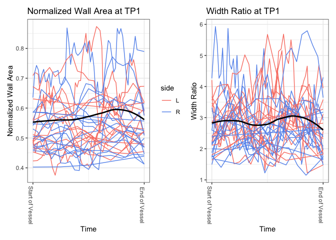<!-- -->

``` r
wa2|wt2;
```

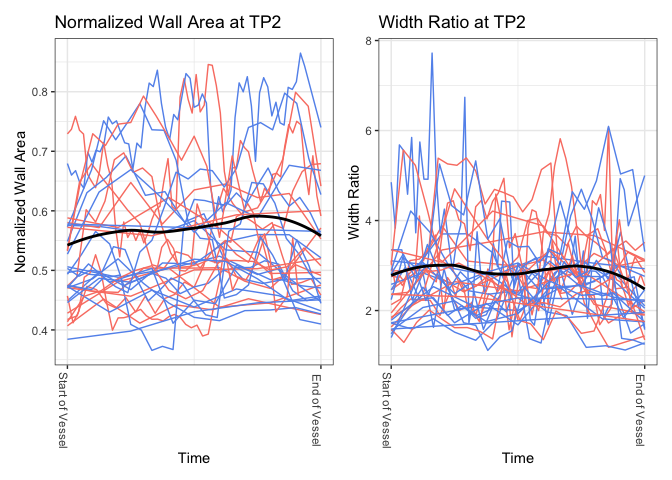<!-- -->

``` r
wa_delta|wt_delta
```

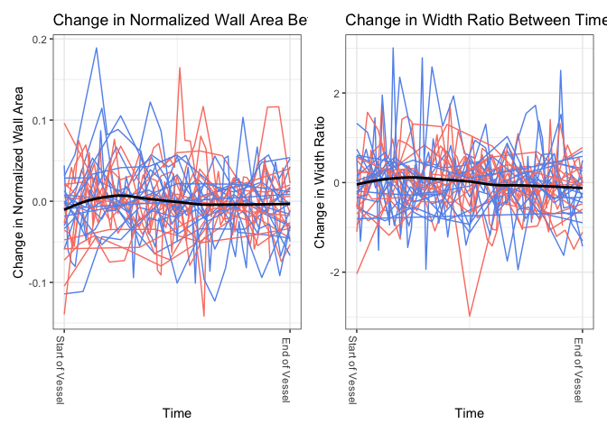<!-- -->

### Mean Functions

``` r
mus = matrix(NA, nrow = 52, ncol = 8)
mus[1:51,1] = seq(0, 1, length.out = 51)
mus[1:51,2] = res_X1$mu
mus[1:51,3] = seq(0, 1, length.out = 51)
mus[1:51,4] = res_X2$mu
mus[1:52,5] = seq(0, 1, length.out = 52)
mus[1:52,6] = res_Y1$mu
mus[1:52,7] = seq(0, 1, length.out = 52)
mus[1:52,8] = res_Y2$mu
mus = as.data.frame(mus)

mus %>%
  ggplot()+
  geom_line(aes(x = V1, y = V2, color = "NW", linetype = "TP1")) +
  geom_line(aes(x = V3, y = V4, color = "WR", linetype = "TP1")) +
  geom_line(aes(x = V5, y = V6, color = "NW", linetype = "Delta")) +
  geom_line(aes(x = V7, y = V8, color = "WR", linetype = "Delta")) +
  theme_bw() +
  labs(title = "Mean Functions",
       x = "Time",
       y = "Mean Function Value",
       color = "Function")
```

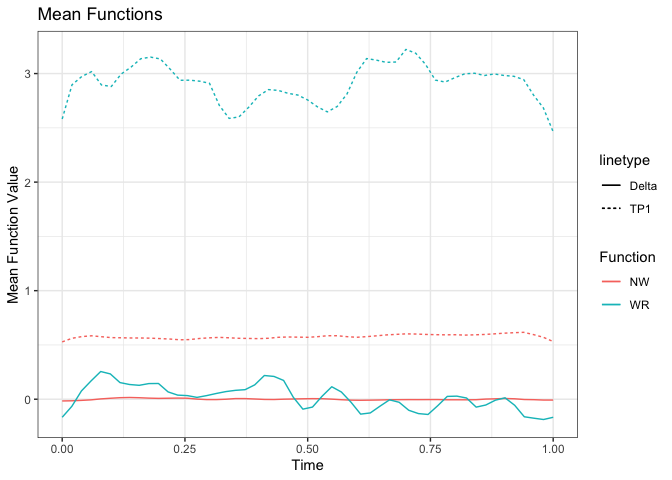<!-- -->

### Eigenfunctions

``` r
eigs = data.frame(
  Var = rep(c("NW", "WR"), each = 103),
  Type = c(rep("TP1", 51), rep("Delta", 52), rep("TP1", 51), rep("Delta", 52)),
  t = c(seq(0, 1, length.out = 51), seq(0, 1, length.out = 52), seq(0, 1, length.out = 51), seq(0, 1, length.out = 52)),
  E1 = c(res_X1$phi[,1], res_Y1$phi[,1], res_X2$phi[,1], res_Y2$phi[,1]),
  E2 = c(res_X1$phi[,2], res_Y1$phi[,2], res_X2$phi[,2], res_Y2$phi[,2]),
  E3 = c(res_X1$phi[,3], res_Y1$phi[,3], res_X2$phi[,3], res_Y2$phi[,3])
)

eigs %>%
  ggplot(aes(x = t, y = E1, color = Var, linetype = Type)) +
  geom_line() +
  theme_bw() +
  labs(title = "First Eigenfunctions",
       x = "Time",
       y = "Eigenfunction Value",
       color = "Time Point")
```

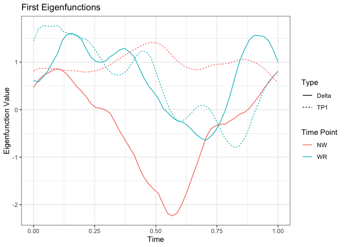<!-- -->

``` r

eigs %>%
  ggplot(aes(x = t, y = E2, color = Var, linetype = Type)) +
  geom_line() +
  theme_bw() +
  labs(title = "Second Eigenfunctions",
       x = "Time",
       y = "Eigenfunction Value",
       color = "Time Point")
```

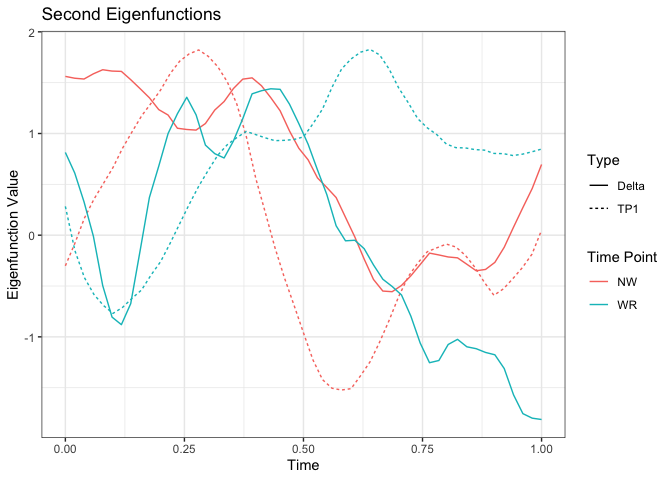<!-- -->

``` r

eigs %>%
  ggplot(aes(x = t, y = E3, color = Var, linetype = Type)) +
  geom_line() +
  theme_bw() +
  labs(title = "Third Eigenfunctions",
       x = "Time",
       y = "Eigenfunction Value",
       color = "Time Point")
```

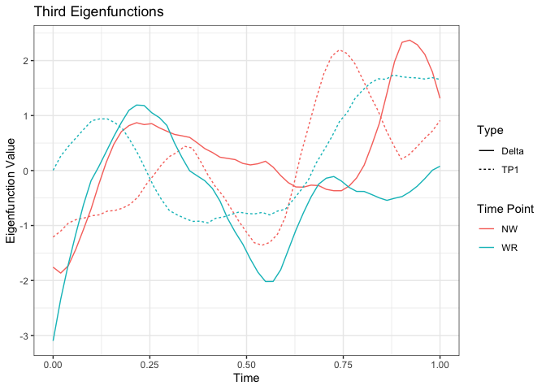<!-- -->

## MFPCA

``` r
res_pred = FunOnFun::irregMFPCA(
  components = 10,
  split = T,
  res_X1,
  res_X2
)

res_resp = FunOnFun::irregMFPCA(
  components = 10,
  split = T,
  res_Y1,
  res_Y2
)
```

## Function on Function Regression

``` r
Bhat = FunOnFun::funOnFun(res_resp, res_pred)
Betahat = FunOnFun::reconBeta(res_resp, res_pred, Bhat$Bhat)
rvec = rep(NA, 104)
cvec = rep(NA, 102)

rvec[1] = "NW Start"
rvec[52] = "NW End"
rvec[53] = "WR Start"
rvec[104] = "WR End"

cvec[1] = "NW Start"
cvec[51] = "NW End"
cvec[52] = "WR Start"
cvec[102] = "WR End"

rownames(Betahat) = rvec
colnames(Betahat) = cvec

normalize_matrix = function(mat){
  (mat - min(mat))/(max(mat) - min(mat))
}

# plotly::plot_ly(z = Betahat[1:52, 1:51],
#                 type = "heatmap",
#                 zmin = min(Betahat),
#                 zmax = max(Betahat))

brk = seq(0, 1, length.out = 101)

heatmap(normalize_matrix(Betahat[1:52, 1:51]),
        Rowv = NA, Colv = NA,
        scale = "none",
        ylab = "Delta (TP2 - TP1)",
        xlab = "Time Point 1",
        main = "NW X NW",
        breaks = brk,
        col = scico::scico(n = 100, palette = "roma"))

heatmap(normalize_matrix(Betahat[1:52, 52:102]), 
        Rowv = NA, Colv = NA,
        scale = "none",
        ylab = "Delta (TP2 - TP1)",
        xlab = "Time Point 1",
        main = "NW X WR",
        breaks = brk,
        col = scico::scico(n = 100, palette = "roma"))

heatmap(normalize_matrix(normBetahat[53:104, 1:51]), 
        Rowv = NA, Colv = NA,
        scale = "none",
        ylab = "Delta (TP2 - TP1)",
        xlab = "Time Point 1",
        main = "WR X NW",
        breaks = brk,
        col = scico::scico(n = 100, palette = "roma"))

heatmap(normalize_matrix(normBetahat[53:104, 52:102]), 
        Rowv = NA, Colv = NA,
        scale = "none",
        ylab = "Delta (TP2 - TP1)",
        xlab = "Time Point 2",
        main = "WR X WR",
        breaks = brk,
        col = scico::scico(n = 100, palette = "roma"))
legend(x="right", 
       legend= c("0", "0.5", "1"), 
       fill= scico::scico(n = 3, palette = "roma"))
```

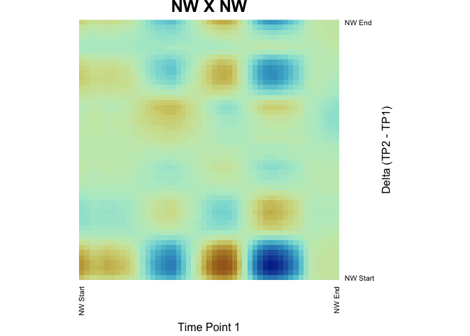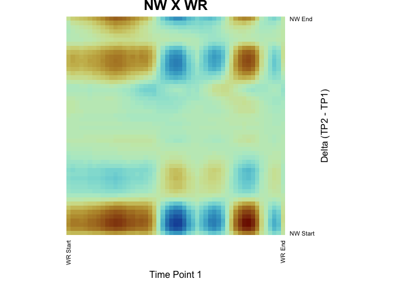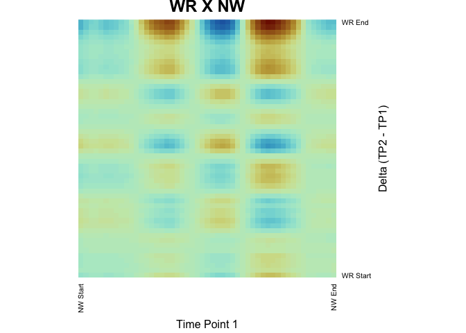

## CV for Optimal Number of Eigenfunctions

``` r
cvMatrix = FunOnFun::cvfunOnFun(
  seed = 16,
  predictor = res_pred,
  response = res_resp,
  actual = tp2,
  folds = 10
)

# Row is for TP1, Col is for TP2
which(cvMatrix == min(cvMatrix), 
      arr.ind = T)
#>      row col
#> [1,]   2   1
```

### Conduct Regression

``` r
res_pred = FunOnFun::irregMFPCA(
  components = 2,
  split = T,
  res_X1,
  res_X2
)

res_resp = FunOnFun::irregMFPCA(
  components = 1,
  split = T,
  res_Y1,
  res_Y2
)

Bhat = FunOnFun::funOnFun(res_resp, res_pred)
Betahat = FunOnFun::reconBeta(res_resp, res_pred, Bhat$Bhat)

rvec[1] = "NW Start"
rvec[52] = "NW End"
rvec[53] = "WR Start"
rvec[104] = "WR End"

cvec[1] = "NW Start"
cvec[51] = "NW End"
cvec[52] = "WR Start"
cvec[102] = "WR End"

rownames(Betahat) = rvec
colnames(Betahat) = cvec

par(mfrow = c(2, 2))

heatmap(normalize_matrix(Betahat[1:52, 1:51]),
        Rowv = NA, Colv = NA,
        scale = "none",
        ylab = "Delta (TP2 - TP1)",
        xlab = "Time Point 1",
        main = "NW X NW",
        breaks = brk,
        col = scico::scico(n = 100, palette = "roma"))

heatmap(normalize_matrix(Betahat[1:52, 52:102]),
        Rowv = NA, Colv = NA,
        scale = "none",
        ylab = "Delta (TP2 - TP1)",
        xlab = "Time Point 1",
        main = "NW X WR",
        breaks = brk,
        col = scico::scico(n = 100, palette = "roma"))

heatmap(normalize_matrix(Betahat[53:104, 1:51]),
        Rowv = NA, Colv = NA,
        scale = "none",
        ylab = "Delta (TP2 - TP1)",
        xlab = "Time Point 1",
        main = "WR X NW",
        breaks = brk,
        col = scico::scico(n = 100, palette = "roma"))

heatmap(normalize_matrix(Betahat[53:104, 52:102]),
        Rowv = NA, Colv = NA,
        scale = "none",
        ylab = "Delta (TP2 - TP1)",
        xlab = "Time Point 2",
        main = "WR X WR",
        breaks = brk,
        col = scico::scico(n = 100, palette = "roma"))

legend(x="right",
       legend= c("0", "0.5", "1"),
       fill= scico::scico(n = 3, palette = "roma"))
```

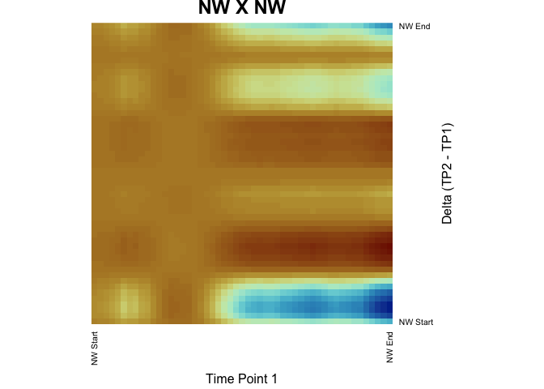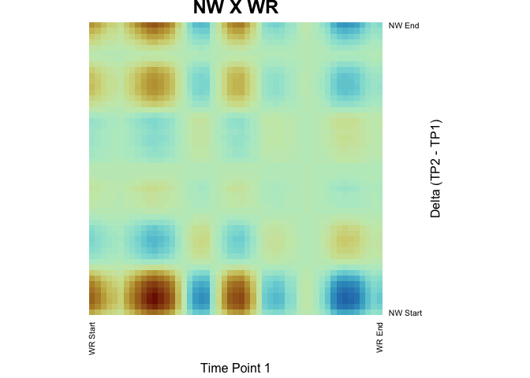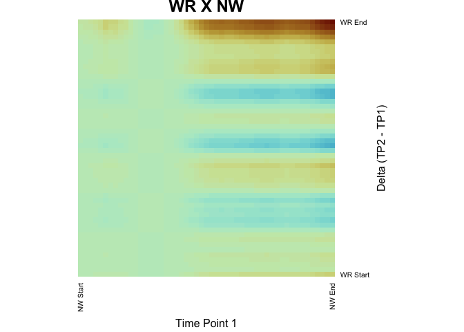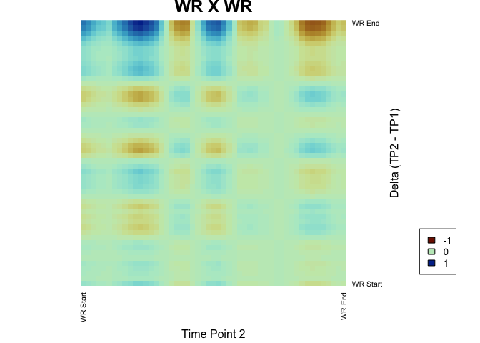
