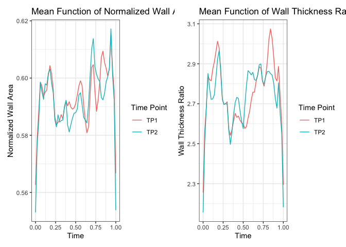
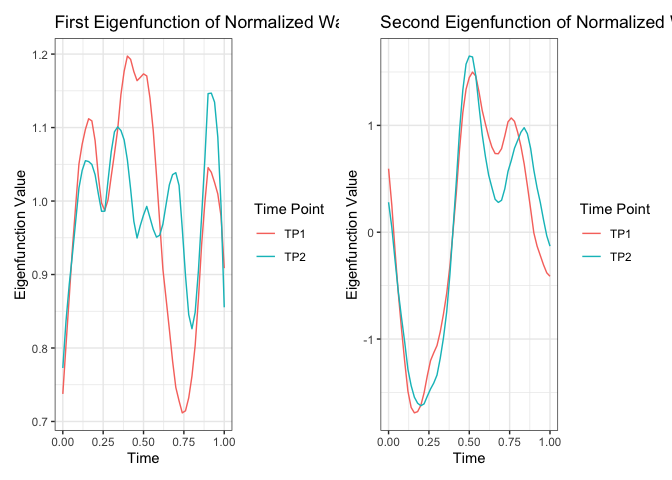
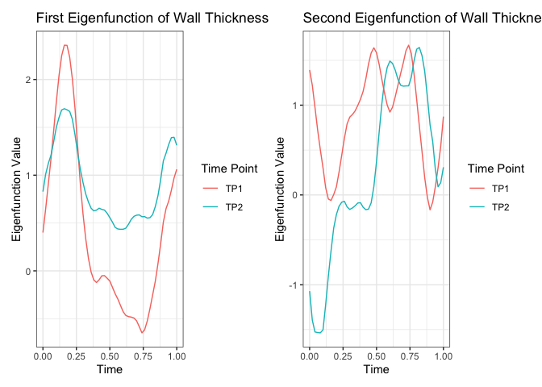
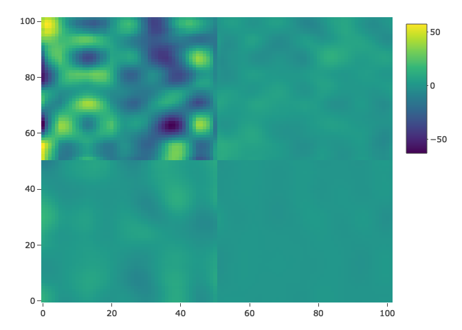
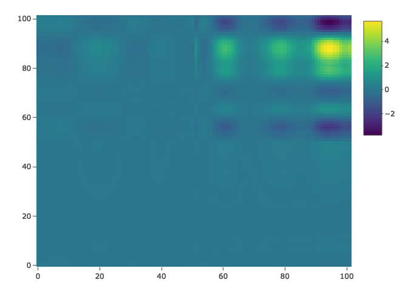

WALLI
================

``` r
library(FunOnFun)
library(tidyverse)
library(brolgar)
library(fdapace)
library(patchwork)
```

## Read Data

``` r
# TODO: Integrate data to package
tp1 = read.csv("../../walli.csv")[c(1, 6, 7, 8, 9)] %>%
  stats::na.omit() %>%
  filter(max_wt_1 > 0) %>% # Lose 13 observations that were all 0
  dplyr::arrange(plaque_id) %>%
  dplyr::mutate(norm_wall = wa_1/(wa_1 + la_1),
         wt_rat = max_wt_1/min_wt_1) %>%
  FunOnFun::regularizeTime(id_col = "plaque_id")

tp2 = read.csv("../../walli.csv")[c(1, 15, 16, 17, 18)] %>%
  stats::na.omit() %>%
  filter(max_wt_2 > 0) %>% # Different number of observations!
  dplyr::arrange(plaque_id) %>%
  dplyr::mutate(norm_wall = wa_2/(wa_2 + la_2),
         wt_rat = max_wt_2/min_wt_2) %>%
  FunOnFun::regularizeTime(id_col = "plaque_id")
```

## Format Data

``` r
tp1 = tp1 %>% FunOnFun::fpcaFormat(id_col = "plaque_id", var_cols = c("norm_wall", "wt_rat"))
tp2 = tp2 %>% FunOnFun::fpcaFormat(id_col = "plaque_id", var_cols = c("norm_wall", "wt_rat"))
```

## Run FPCA

``` r
res_X1 = fdapace::FPCA(
  tp1$norm_wall,
  tp1$Time,
  list(dataType='Sparse', 
       error=FALSE, 
       kernel='epan', 
       verbose=TRUE)
)

res_X2 = fdapace::FPCA(
  tp1$wt_rat,
  tp1$Time,
  list(dataType='Sparse', 
       error=FALSE, 
       kernel='epan', 
       verbose=TRUE)
)

res_Y1 = fdapace::FPCA(
  tp2$norm_wall,
  tp2$Time,
  list(dataType='Sparse', 
       error=FALSE, 
       kernel='epan', 
       verbose=TRUE)
)

res_Y2 = fdapace::FPCA(
  tp2$wt_rat,
  tp2$Time,
  list(dataType='Sparse', 
       error=FALSE, 
       kernel='epan', 
       verbose=TRUE)
)
```

### Mean Functions

``` r
mus = data.frame(
  Var = rep(c("TP1", "TP2"), each = 51),
  t = c(seq(0, 1, length.out = 51), seq(0, 1, length.out = 51)),
  NW = c(res_X1$mu, res_Y1$mu),
  WR = c(res_X2$mu, res_Y2$mu)
)

p1 = mus %>%
  ggplot(aes(x = t, y = NW, color = Var)) +
  geom_line() +
  theme_bw() +
  labs(title = "Mean Function of Normalized Wall Area",
       x = "Time",
       y = "Normalized Wall Area",
       color = "Time Point")

p2 = mus %>%
  ggplot(aes(x = t, y = WR, color = Var)) +
  geom_line() +
  theme_bw() +
  labs(title = "Mean Function of Wall Thickness Ratio",
       x = "Time",
       y = "Wall Thickness Ratio",
       color = "Time Point")

p1|p2
```

<!-- -->

### Eigenfunctions

``` r
eigs = data.frame(
  Var = rep(c("TP1", "TP2"), each = 51),
  t = c(seq(0, 1, length.out = 51), seq(0, 1, length.out = 51)),
  NW1 = c(res_X1$phi[, 1], res_Y1$phi[, 1]),
  NW2 = c(res_X1$phi[, 2], res_Y1$phi[, 2]),
  WR1 = c(res_X2$phi[, 1], res_Y2$phi[, 1]),
  WR2 = c(res_X2$phi[, 2], res_Y2$phi[, 2])
)

p1 = eigs %>%
  ggplot(aes(x = t, y = NW1, color = Var)) +
  geom_line() +
  theme_bw() +
  labs(title = "First Eigenfunction of Normalized Wall Area",
       x = "Time",
       y = "Eigenfunction Value",
       color = "Time Point")

p2 = eigs %>%
  ggplot(aes(x = t, y = NW2, color = Var)) +
  geom_line() +
  theme_bw() +
  labs(title = "Second Eigenfunction of Normalized Wall Area",
       x = "Time",
       y = "Eigenfunction Value",
       color = "Time Point")

p3 = eigs %>%
  ggplot(aes(x = t, y = WR1, color = Var)) +
  geom_line() +
  theme_bw() +
  labs(title = "First Eigenfunction of Wall Thickness Ratio",
       x = "Time",
       y = "Eigenfunction Value",
       color = "Time Point")

p4 = eigs %>%
  ggplot(aes(x = t, y = WR2, color = Var)) +
  geom_line() +
  theme_bw() +
  labs(title = "Second Eigenfunction of Wall Thickness Ratio",
       x = "Time",
       y = "Eigenfunction Value",
       color = "Time Point")

p1|p2;
```

<!-- -->

``` r
p3|p4
```

<!-- -->

## MFPCA

``` r
res_pred = FunOnFun::irregMFPCA(
  components = 14,
  split = T,
  res_X1,
  res_X2
)

res_resp = FunOnFun::irregMFPCA(
  components = 13,
  split = T,
  res_Y1,
  res_Y2
)
```

## Function on Function Regression

``` r
Bhat = FunOnFun::funOnFun(res_resp, res_pred)
Betahat = FunOnFun::reconBeta(res_resp, res_pred, Bhat$Bhat)


plotly::plot_ly(z = Betahat, 
                type = "heatmap", 
                zmin = min(Betahat),
                zmax = max(Betahat))
```

<!-- -->

### 3D Plot

``` r
estimated_colorscale <- list(
  list(0, "rgb(255, 0, 0)"),
  list(1, "rgb(0, 255, 0)")
)

fig = plotly::plot_ly(showscale = F) %>% 
  plotly::add_surface(z = ~Betahat, 
                      cmin = min(Betahat),
                      cmax = max(Betahat),
                      colorscale = estimated_colorscale)

fig
```

<!-- -->

## CV for Optimal Number of Eigenfunctions

``` r
cvMatrix = FunOnFun::cvfunOnFun(
  seed = 16,
  predictor = res_pred,
  response = res_resp,
  actual = tp2,
  folds = 10
)

which(cvMatrix == min(cvMatrix), 
      arr.ind = T)
#>      row col
#> [1,]   3   1
```

### Conduct Regression

``` r
res_pred = FunOnFun::irregMFPCA(
  components = 3,
  split = T,
  res_X1,
  res_X2
)

res_resp = FunOnFun::irregMFPCA(
  components = 1,
  split = T,
  res_Y1,
  res_Y2
)

Bhat = FunOnFun::funOnFun(res_resp, res_pred)
Betahat = FunOnFun::reconBeta(res_resp, res_pred, Bhat$Bhat)


plotly::plot_ly(z = Betahat, 
                type = "heatmap", 
                zmin = min(Betahat),
                zmax = max(Betahat))
```

<!-- -->

### 3D Plot

``` r
estimated_colorscale <- list(
  list(0, "rgb(255, 0, 0)"),
  list(1, "rgb(0, 255, 0)")
)

fig = plotly::plot_ly(showscale = F) %>% 
  plotly::add_surface(z = ~Betahat, 
                      cmin = min(Betahat),
                      cmax = max(Betahat),
                      colorscale = estimated_colorscale)

fig
```

<!-- -->
